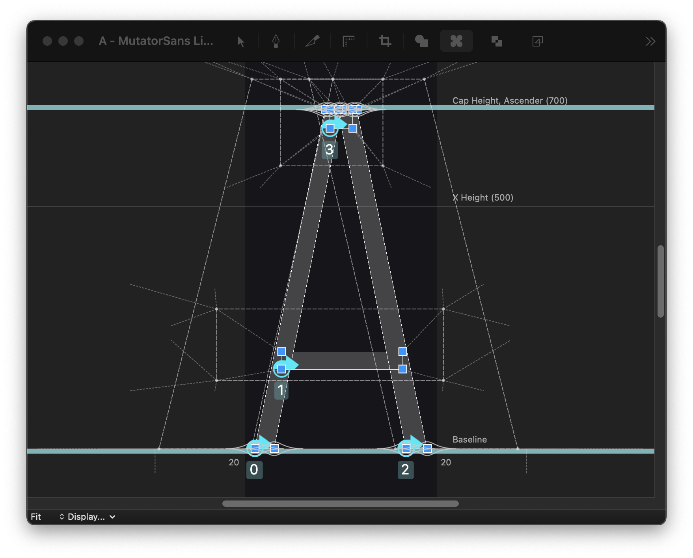

# Longboard

Longboard draws previews of the current designspace in the glyph window.
It is the successor to the Skateboard and Superpolator tools.

Use Longboard to smoothly explore the designspace in the glyph editor. A single mouse drag can manipulate as many axis values as you want. Install via RoboFontMechanic2. Check the Help menu for a page with more details.

This is for RoboFont 4.5+, you need to have the [DesignspaceEditor2 extension](https://github.com/LettError/designSpaceRoboFontExtension) installed. Longboard will activate when you have a designspace open in DSE2, and a glyph edit window for one of the sources.

## Thanks!

* LongBoard is **fast** and exists because of the work, support and help from Frederik Berlaen [TypeMyType Sponsor Page](https://github.com/sponsors/typemytype) and Tal Leming [TypeSupply Sponsor Page](https://github.com/sponsors/typesupply)
* Roberto Arista also worked on an earlier edition of this project.
* In the small industry of type design, your support for shared tools like this makes a huge difference. You, or the company you work for, can sponsor open source type design tools development. This is my [LettError Sponsor Page.](https://github.com/sponsors/letterror)

Visit [LettError.com](https://letterror.com) to see my fonts and other work. Take a look at [Superpolator.com](https://superpolator.com) for the theory of building designspaces for variable fonts, animated examples of interpolation problems and some tips on drawing for interpolation.
