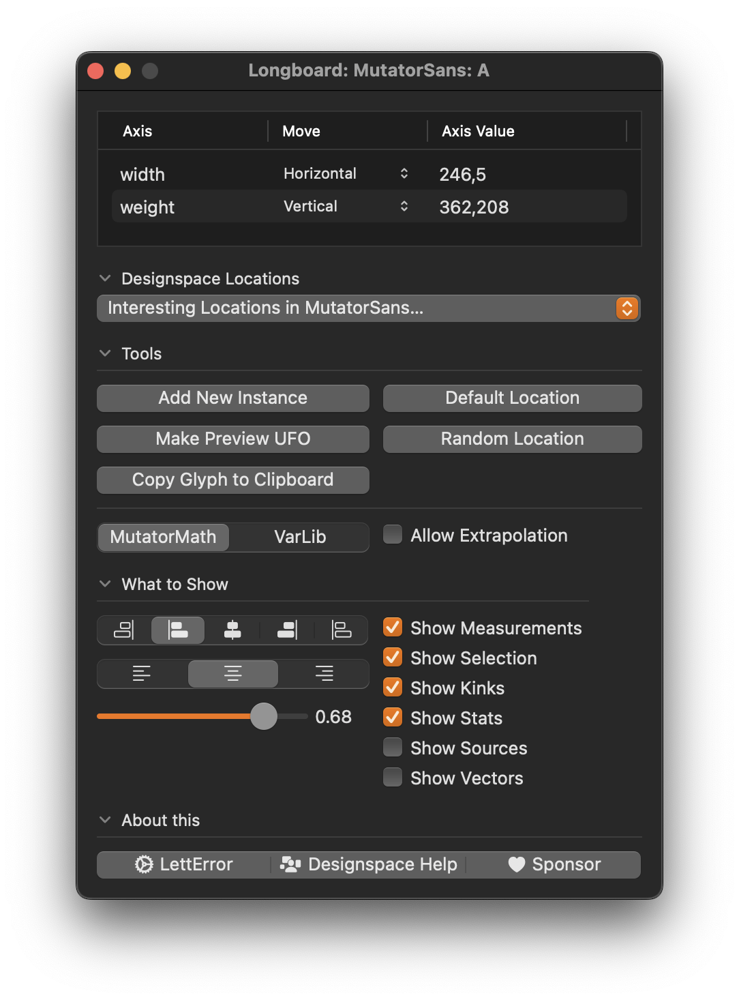

# Longboard

Longboard draws previews of the current designspace in the glyph window.
It is the successor to the **Skateboard** and **Superpolator** tools.

Longboard is for RoboFont 4.5+, you need to have the [DesignspaceEditor2 extension](https://github.com/LettError/designSpaceRoboFontExtension) installed. Longboard will activate when you have a designspace open in DSE2, and a glyph editor window for one of the sources.

Use Longboard to smoothly explore your designspaces in the glyph editor. A single mouse drag can manipulate as many axis values as you want. To set it up, use the table at the top of the LongBoard Window. It lists the **continuous axes** available for exploring. Use the pop up menu next to the axis name to choose a **direction** for the Navigator. For istance, in this image, horizontal movements of the navigator tool will change width axis values. And vertical movements will correspond to change in weight axis values. The **ignore** option in menu prevents that axis from responding to any mouse movement.

* **Drag + Shift Key:** constrain the movement to horizontal or vertical.
* **Drag + Command Key:** for precise movements. If you want to get that one specific value.

Longboard takes the values for the **discrete axes** from the source you're currently looking at. So if your designspace has a continuous weight and a discrete italic axis, Longboard will show upright weight variations in the upright sources, and italic weight variations in italic sources.

Double click on the axis values to edit the numbers. You can also set values for axes you set to **ignore**. Anisotropic values are not yet supported.

The **Tools** and **About** tabs can close to save some space.

## Designspace Locations

This is a popup list with all the relevant locations from the current designspace. Source locations, instance locations.

## Tools

* **Add New Instance** Creates a new instance in the current designspace. Family name is copied from the default source. Style name is created from axis names and values. Use DSE2 to set all the other parameters. LongBoard warns you if the location is already in use. You need the save the designspace after this.
* **Make Preview UFO** This creates a new UFO for the current preview location. RoboFont opens the UFO when it is ready. This UFO can be used for inspection, proofing, detailed measuring and so on. The UFOs are saved in the **/preview** folder next to the designspace file. This will **not** make a new instance in the designspace. If you want to add the preview UFO as a source, you have to move it out of the Previews folder and rename it. Mote: Preview UFOs have floating point coordinates, metrics and kerning because precision, you know what to do.
* **Copy Glyph to Clipboard** Does as advertised. The preview glyph to the clipboard so you can paste it somewhere else. This glyph has decomposed components for obvious reasons, it has floating point coordinates and width. This is also part of the contextual menu. 
* **Default Location** will take the Preview home to the default location. In case you get lost in crazy extrapolations.
* **Random Location** will take the Preview to a random location in the designspace. In case you want to see the sights. If you have **Allow Extrapolation** checked, the random location will extrapolate a bit over the axis extremes.

Also part of the tools panel:

* **MutatorMath / VarLib** switches between the mathematical model used to calculate the previews. **Varlib** is what Variable fonts use. **MutatorMath** is an older model, with better extrapolation. The differences are subtle.
* **Allow Extrapolation** Clip the dragging with the Navigator tool to the axis extremes, or go wildly beyond. Note that Variable font technology can not extrapolate. But during the design of type, extrapolation can be a useful thing. Again, do what you need. Extrapolated previews will be drawn in a differently dashed outline.
* **Allow Anisotropy** Press the Option key while dragging the navigator tool to interpolate the vertical coordinates separate from horizontal coordinates. With this checked you can also type the vertical axis value in the **Anisotropy** column of the axes table. Note: it may be practical to set the movement of all but one axes to “ignore” so that you can see what is happening. Can be used for subtle and precise modifcations of contrast. Or just explore the wild things.

## What to Show

This panel offers controls over what Longboard draws in the glyph editor. It can get a bit crowded, so only show what you need.

* **Left Outside / Left / Center /Right / Right Outside** controls where the preview aligns relative to the glyph. Play with the buttons and see what you prefer.
* **Left / Center /Right** controls where the stats text is drawn.

* **Slider** controls the brightness of the preview.

* **Show Measurements** This applies the RoboFont Measure tool to the preview and shows the dimensions for the preview in blue. This way you can search for very specific stems, for instance.
* **Show Selection** Selected points in the glyph editor will be highlighted in the preview, also showing their coordinates.
* **Show Kinks** For point types marked **smooth** this highlights curve sections where the incoming and outgoing lines are no longer smooth.
* **Show Stats** Collect and show some statistics about the preview instance while dragging: change in surface area, change in width, absolute change in width (in em units) as well as the axis values of the preview location.
* **Show Rounded** All geometry gets rounded to integers, as might happen in some contexts. You will see all the points rattle. 
* **Show Sources** draws all the sources for this glyph as well as the preview. This can be useful, but it can also be quite busy, visually. You be the judge and choose what you need. The sources are drawn centered under the current glyph.
* **Show Vectors** draws a vector between the sources and the preview. So you can see how the points get pulled around. This can be useful to spot compatibility issues.

## About this

This panel offers links to the developer, a designspace theory help page, and the GitHub Sponsor page.

## Navigator

* LongBoard installs a tool in the glyph editor toolbar called **Longboard Navigator**.
* Look for this icon: 
* Select the tool and drag the cursor around in the glyph editor to explore different axis values.
* The preview will remain at the selected value when you switch to a different tool.

## Stats

These are some values that may be interesting, drawn at the bottom of the window and updated while dragging. 

* The axis value, per axis. Continous axes have a **-** prefix. Discrete axes have a **:** prefix. Anisotropic values are shown in 2 rows.
* Δ area: change in glyph area, percent, measured from the start of the drag.
* Δ width: change in glyph width, percent, measured from the start of the drag.
* abs width, change in width, em units, measured from the start of the drag.
* Measurement ratio: if you have 2 separate measurement lines, and each of these lines only reports 1 value, then the measurement ratio indicates the ratio between these values.

## Notes

* The mapping of mouse movements to axis values is done with a *Subjective Algorithm™.* That means "it works here with the designspaces I tested it with", As long as your axes have values that are roughly on a 0 - 1000 scale it will be fine, but there may be some speed issues if the axes are on a smaller scale, like 0 - 1. I may follow up on that. Otherwise, use your common sense.
* With this tool most of the functionality that I wrote for **Skateboard** and indeed **Superolator** should be available to you. **DesignspaceEditor2** does all the heavy lifting. Longboard is a clever visualiser tool on top of DSE. I hope you enjoy. Feel free to check the GitHub sponsor page.
* The preview location is stored in the designspace lib. If you have several designspaces open, each will have its own preview location. Save the designspace if you want to keep this location for the next session. 
* Exploring anisotropic values can be very interesting and this tools offers access to them because they may be useful for design purposes. But you understand that such values will not work in instances and variable fonts. 

## Thanks!

* LongBoard is **fast** and exists because of the work, support and help from [Frederik Berlaen](https://github.com/sponsors/typemytype) and [Tal Leming](https://github.com/sponsors/typesupply)
* Roberto Arista also worked on an earlier edition of this project. Also many thanks to Ryan Bugden for help and suggestions.
* GitHub Sponsors who make the development of open, specialised, shared tools like this possible. In the small industry of type design, that makes a huge difference. You, or the company you work for, can sponsor open source type design tools like this. [My sponsor page is here.](https://github.com/sponsors/letterror)
* And all Skateboard 🛹 and Superpolator  users for your support, feedback and patience!

Visit [LettError.com](https://letterror.com) to see my fonts and other work. Take a look at [Superpolator.com](https://superpolator.com) for the theory of building designspaces for variable fonts, animated examples of interpolation problems and some tips on drawing for interpolation.

## Versions
* 1.3.2 Initial public release
* 1.3.3 Add Kink reporting, UI tweaks.
* 1.3.4 Fix issue with default location.
* 1.3.5 Add some modifier key features.
* 1.3.6 Add stats, new screenshots.
* 1.3.12 Show selected points, improve stats, interface
* 1.3.14 Add ratio of measurements to stats
* 1.4.0 Add support for anisotropic navigation.
